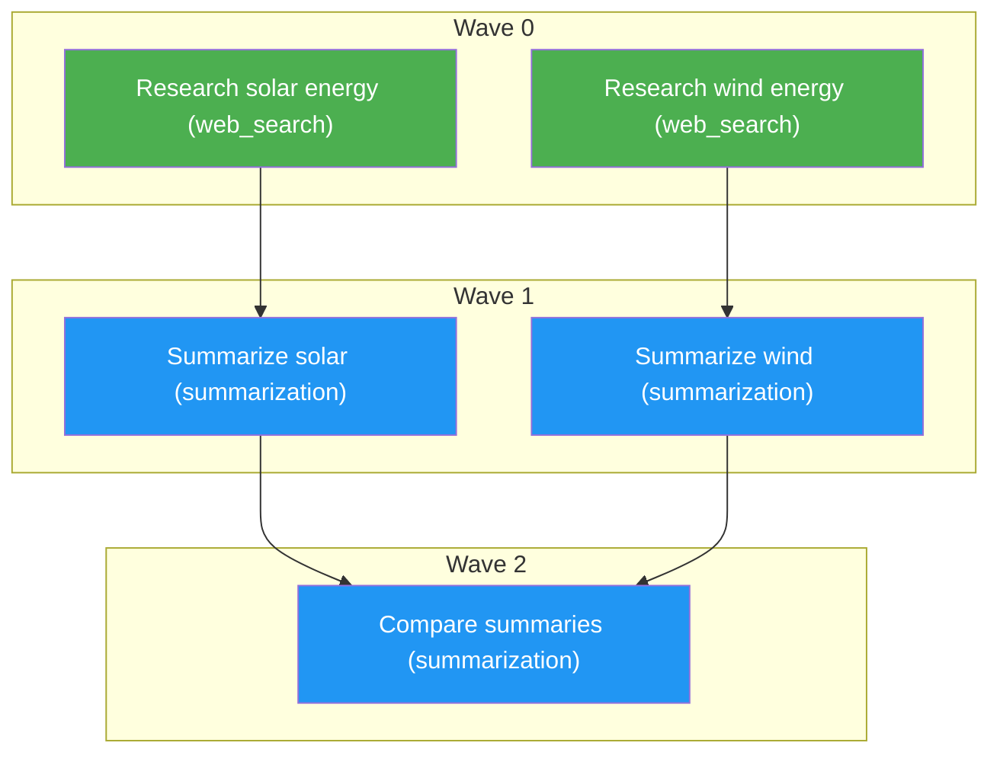

# AOS v0.0.2 — Adaptive Cognitive AI Microkernel

**AOS** (Adaptive Cognitive System) is a lightweight agentic framework that decomposes user prompts into **task graphs** — directed acyclic graphs (DAGs) of capability-routed nodes — and executes them concurrently in dependency-respecting waves. The system is designed as a minimal, composable microkernel: each agent role is a single class, each capability is a standalone function, and the pipeline is deterministic and auditable.

---

## Table of Contents

- [Architecture](#architecture)
- [Pipeline Flow](#pipeline-flow)
- [Project Structure](#project-structure)
- [Components](#components)
  - [Models (`models.py`)](#models-modelspy)
  - [Manager Agent (`agents/manager_agent.py`)](#manager-agent-agentsmanager_agentpy)
  - [Graph Executor (`agents/graph_executor.py`)](#graph-executor-agentsgraph_executorpy)
  - [Sub-Agent (`agents/sub_agent.py`)](#sub-agent-agentssub_agentpy)
  - [Integrator Agent (`agents/integrator_agent.py`)](#integrator-agent-integrator_agentpy)
  - [Capabilities](#capabilities)
  - [Graph Utilities (`graph_utils.py`)](#graph-utilities-graph_utilspy)
  - [Diagram Utilities (`diagram_utils.py`)](#diagram-utilities-diagram_utilspy)
- [Data Models](#data-models)
- [Execution Model: Waves](#execution-model-waves)
- [Deterministic Diagrams](#deterministic-diagrams)
- [Semantic Completeness Verification](#semantic-completeness-verification)
- [Installation & Setup](#installation--setup)
- [Usage](#usage)
- [Configuration](#configuration)
- [Design Decisions](#design-decisions)
- [Upgrade Path](#upgrade-path)

---

## Architecture

```
User Prompt
     │
     ▼
┌──────────────────────┐
│   Manager Agent       │  LLM decomposes prompt → Graph (DAG of Nodes)
│                      │  Validates structurally + checks semantic completeness
└──────────────────────┘
     │
     ├──► writes outputs/plan.md  (node table + wave breakdown + Mermaid diagram)
     │
     ▼
┌──────────────────────┐
│   Graph Executor      │  Groups nodes into waves via topological sort
│                      │  Executes each wave concurrently via ThreadPoolExecutor
│                      │  Injects vision context into all downstream nodes
└──────────────────────┘
     │
     ▼
┌──────────────────────┐
│   Sub-Agent (×N)      │  One instance per node, capability-resolved at runtime
│                      │  Each calls the appropriate capability function
└──────────────────────┘
     │
     ▼
┌──────────────────────┐
│   Integrator Agent    │  Collects sink nodes (nodes with no dependents)
│                      │  Returns labeled concatenation of their outputs
└──────────────────────┘
     │
     ▼
   Final Output
```

## Pipeline Flow

1. **User input** — a text prompt and optionally an `--image` path.
2. **Manager Agent** sends the prompt to an LLM (Groq `llama-3.3-70b-versatile`) with a schema-constrained function-calling prompt. The LLM returns a `Graph` object: a list of `Node` objects with `id`, `description`, `capability`, and `depends_on` edges.
3. **Structural validation** — `validate_graph()` checks for duplicate IDs, dangling references, missing roots, and cycles. Up to 1 retry.
4. **Semantic completeness check** — a separate LLM call verifies every named entity in the prompt has at least one dedicated node. If incomplete, the graph is regenerated once.
5. **Plan output** — `outputs/plan.md` is written with a node table, wave breakdown, and a deterministic Mermaid diagram.
6. **Graph Executor** topologically sorts nodes into waves. Each wave's nodes execute concurrently via threads. Parent outputs are concatenated and passed as input to child nodes.
7. **Vision context injection** — once the vision node completes, its identification output is injected into every downstream non-vision node's input, ensuring image context is never lost through intermediate summarization.
8. **Integrator Agent** collects all sink nodes (nodes that no other node depends on) and returns their labeled concatenated outputs.

## Components

### Models (`models.py`)

Two Pydantic models form the type system:

| Model | Fields | Description |
|-------|--------|-------------|
| `Node` | `id`, `description`, `capability`, `depends_on`, `input`, `output`, `status`, `performed_by` | A single unit of work. |
| `Graph` | `job`, `nodes` | A full DAG: the original job + a list of Nodes. |

`capability` must be one of: `web_search`, `summarization`, `vision`.

### Manager Agent (`agents/manager_agent.py`)

The orchestrator. Responsibilities:

1. **Graph generation** — calls Groq's `llama-3.3-70b-versatile` with a system prompt that enforces:
   - One `web_search` + one `summarization` node per named entity (no collapsing multiple entities into one node).
   - Parallelism where possible.
   - Vision node when an image is provided.
2. **Structural validation** — `validate_graph()` detects cycles, dangling deps, and duplicate IDs. Up to 1 automated retry with the validation error fed back.
3. **Semantic completeness check** — a secondary LLM call audits whether every named entity in the job has dedicated node(s). Up to 1 retry. Prints `[manager-agent] completeness check: COMPLETE` or `INCOMPLETE` with reason.
4. **Artifact generation** — writes `outputs/plan.md` with:
   - Node table (ID, description, capability, dependencies)
   - Wave breakdown (plain text)
   - Mermaid diagram (via `diagram_utils.build_mermaid()`)
5. **README upkeep** — maintains the `

## How AOS v0.0.3 plans and executes tasks

AOS decomposes a user job into a **task graph** — a directed acyclic graph
(DAG) of **nodes** connected by **edges**.

- **Node:** a single unit of work. Each node has a unique `id`, a `description`
  (which doubles as the instruction passed to its capability), a `capability`
  (the coarse tool hint, e.g. `web_search`, `summarization`, or `vision`), a
  **Capability DNA** vector, and a `depends_on` list of node ids it must wait
  for.
- **Edge:** a dependency from one node to another. If node C has
  `depends_on: ["a", "b"]`, it runs only after both A and B finish, and
  receives their outputs as input.

**Capability DNA (DOC1 §5.2):** planning and resource selection are separate
passes. The Manager Agent only decomposes; a dedicated **DNA Extractor** then
maps each subtask to a typed requirement vector with three segments —
discrete capability `flags`, `ordinals` scoring difficulty 0–4, and
`constraints` (cost ceiling, latency SLO, min quality, risk tolerance). The
extractor runs a cheap model first and escalates to a strong one only when its
self-reported confidence falls below threshold.

**Two-stage binding (DOC1 M5):** for each node the Capability Registry first
applies a **feasibility filter** — a resource must provide every flag in the
DNA and satisfy all four constraints — then scores the survivors with a Pareto
scorer, `score = quality_prior − λ·cost − μ·latency`, with cost and latency
normalised against that subtask's own ceiling and SLO. The winner, the
runner-up margin, and the reason each rejected resource was filtered are all
logged.

**Concurrency:** nodes in the same dependency "wave" are independent and run
concurrently via threads. For example, in the graph below, nodes `a` and `b`
run in parallel, then `c` and `d` run in parallel, and finally `e` runs.

**Multi-parent merging:** a node with multiple parents receives the labeled,
concatenated outputs of all its parents, so it can compare, combine, or
reconcile them.

**Diagrams:** the Mermaid diagrams in `outputs/plan.md` are generated
deterministically from the validated graph by `diagram_utils.build_mermaid()`,
not by the LLM. This is a deliberate reliability choice — the diagram always
faithfully represents the actual graph structure, wave assignments, and
capability types, with no risk of the LLM inventing or omitting nodes.


