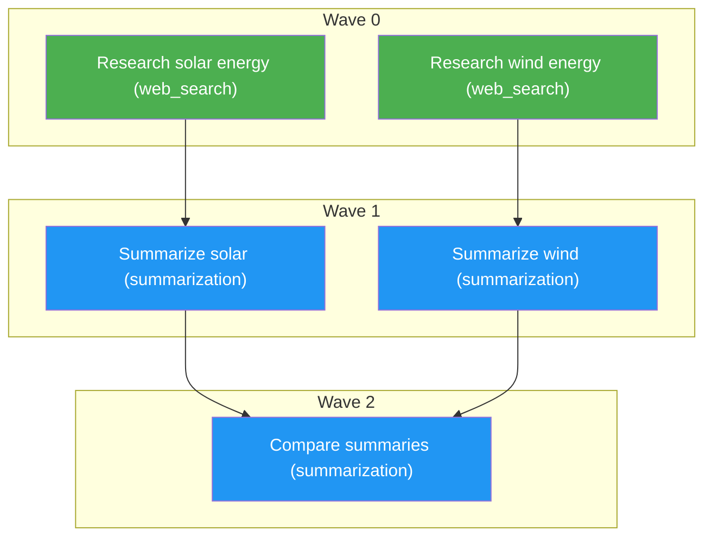

# AOS v0.1.0 — Adaptive Cognitive AI Microkernel

AOS (Adaptive Cognitive System) is a lightweight agentic framework that decomposes user prompts into task graphs — directed acyclic graphs (DAGs) of capability-routed nodes — and executes them concurrently in dependency-respecting waves.

AOS is designed as a minimal, composable, deterministic, and auditable microkernel. Each agent role has a focused responsibility, capabilities are independently implemented, and resource selection is separated from task planning through Capability DNA and a dedicated DNA Extractor.

## Table of Contents

- [Architecture](#architecture)
- [Pipeline Flow](#pipeline-flow)
- [Project Structure](#project-structure)
- [Task Graph Model](#task-graph-model)
- [Capability DNA](#capability-dna)
- [Two-Stage Capability Binding](#two-stage-capability-binding)
- [Components](#components)
  - [Models (models.py)](#models-modelspy)
  - [Manager Agent (agents/manager_agent.py)](#manager-agent-agentsmanager_agentpy)
  - [DNA Extractor](#dna-extractor)
  - [Capability Registry](#capability-registry)
  - [Graph Executor (agents/graph_executor.py)](#graph-executor-agentsgraph_executorpy)
  - [Sub-Agent (agents/sub_agent.py)](#sub-agent-agentssub_agentpy)
  - [Integrator Agent (agents/integrator_agent.py)](#integrator-agent-agentsintegrator_agentpy)
- [Capabilities](#capabilities)
- [Graph Utilities (graph_utils.py)](#graph-utilities-graph_utilspy)
- [Diagram Utilities (diagram_utils.py)](#diagram-utilities-diagram_utilspy)
- [Execution Model: Waves](#execution-model-waves)
- [Multi-Parent Merging](#multi-parent-merging)
- [Semantic Completeness Verification](#semantic-completeness-verification)
- [Deterministic Diagrams](#deterministic-diagrams)
- [Auditability and Logging](#auditability-and-logging)
- [Installation & Setup](#installation--setup)
- [Usage](#usage)
- [Configuration](#configuration)
- [Design Decisions](#design-decisions)
- [Upgrade Path](#upgrade-path)

## Architecture

AOS separates planning, requirement extraction, resource selection, and execution.

```
                         User Prompt
                              │
                              ▼
                    ┌─────────────────────┐
                    │    Manager Agent    │
                    │                     │
                    │ Decomposes prompt   │
                    │ into task graph     │
                    └──────────┬──────────┘
                               │
                               ▼
                    ┌─────────────────────┐
                    │ Structural +        │
                    │ Semantic Validation │
                    └──────────┬──────────┘
                               │
                               ▼
                    ┌─────────────────────┐
                    │    DNA Extractor    │
                    │                     │
                    │ Task → Capability   │
                    │ DNA requirement     │
                    └──────────┬──────────┘
                               │
                               ▼
                    ┌─────────────────────┐
                    │ Capability Registry │
                    │                     │
                    │ Feasibility Filter  │
                    │         ↓           │
                    │ Pareto Scoring      │
                    │         ↓           │
                    │ Resource Binding    │
                    └──────────┬──────────┘
                               │
                               ▼
                    ┌─────────────────────┐
                    │   Graph Executor    │
                    │                     │
                    │ Topological waves   │
                    │ Concurrent execution│
                    └──────────┬──────────┘
                               │
                               ▼
                    ┌─────────────────────┐
                    │     Sub-Agents      │
                    │                     │
                    │ Execute bound       │
                    │ capabilities       │
                    └──────────┬──────────┘
                               │
                               ▼
                    ┌─────────────────────┐
                    │  Integrator Agent   │
                    │                     │
                    │ Collects sink nodes │
                    │ and builds output   │
                    └──────────┬──────────┘
                               │
                               ▼
                         Final Output
```

The key architectural principle in v0.1.0 is:

> The Manager decides what needs to be done; the DNA Extractor describes what resources are required; the Capability Registry decides how it should be performed.

## Pipeline Flow

1. **User input** — A text prompt and optionally an `--image` path are supplied.

2. **Task decomposition** — The Manager Agent sends the prompt to the configured LLM and produces a Graph consisting of task nodes and dependency edges.

3. **Structural validation** — `validate_graph()` checks the generated graph for:
   - Duplicate node IDs
   - Dangling dependencies
   - Missing roots
   - Cycles
   - Invalid graph structure

   The Manager can retry graph generation when validation fails.

4. **Semantic completeness verification** — A separate LLM-based check verifies that all important named entities in the job are represented by appropriate task nodes. If the graph is incomplete, it can be regenerated.

5. **Plan generation** — A deterministic execution plan is written to `outputs/plan.md`, including:
   - Node table
   - Dependencies
   - Execution waves
   - Capability information
   - Mermaid graph

6. **Capability DNA extraction** — After planning, the DNA Extractor independently converts each subtask into a typed capability requirement vector.

7. **Resource feasibility filtering** — The Capability Registry removes resources that cannot satisfy the node's required capability flags or constraints.

8. **Resource scoring** — Feasible resources are ranked using the Pareto scoring function:

   ```
   score = quality_prior − λ·cost − μ·latency
   ```

   Cost and latency are normalized against the requirements of the individual subtask.

9. **Capability binding** — The highest-scoring feasible resource is selected for the node. The runner-up margin and rejected-resource reasons are recorded for auditability.

10. **Wave execution** — The Graph Executor topologically sorts the graph into dependency waves. Independent nodes in the same wave execute concurrently.

11. **Multi-parent input merging** — Nodes with multiple dependencies receive labeled outputs from all completed parents.

12. **Vision context propagation** — When a vision node is present, its identification output is injected into downstream non-vision tasks so image-derived context is not lost through intermediate processing.

13. **Integration** — The Integrator Agent collects sink-node outputs and combines them into the final response.

## Project Structure

A typical AOS project is organized around a small set of focused components:

```
AOS/
├── agents/
│   ├── manager_agent.py
│   ├── graph_executor.py
│   ├── sub_agent.py
│   └── integrator_agent.py
│
├── capabilities/
│   ├── web_search.py
│   ├── summarization.py
│   └── vision.py
│
├── models.py
├── graph_utils.py
├── diagram_utils.py
│
├── outputs/
│   └── plan.md
│
├── README.md
└── ...
```

The exact module layout may evolve, but the architectural separation remains:

- **Agents** orchestrate work.
- **Models** define the typed data structures.
- **Capabilities** perform concrete work.
- **DNA extraction** defines resource requirements.
- **Capability Registry** performs resource selection.
- **Graph utilities** validate and analyze DAGs.
- **Diagram utilities** generate deterministic visualizations.

## Task Graph Model

AOS represents every job as a directed acyclic graph.

### Node

A node represents one unit of work.

Each node contains information such as:

| Field          | Purpose                                      |
|----------------|----------------------------------------------|
| `id`           | Unique node identifier                       |
| `description`  | Task instruction                             |
| `capability`   | Coarse capability hint                       |
| `capability_dna`| Typed resource requirements                 |
| `depends_on`   | IDs of prerequisite nodes                    |
| `input`        | Runtime input                                |
| `output`       | Produced result                              |
| `status`       | Execution state                              |
| `performed_by` | Selected resource/capability                 |

The coarse capability field provides a high-level hint such as:
- `web_search`
- `summarization`
- `vision`

The Capability DNA provides the more precise resource requirements used during capability binding.

### Edge

An edge represents a dependency.

For example:
```
C depends_on A and B
```
means C cannot execute until both A and B complete.

```
A ──► C
B ──► C
```

The outputs from A and B are then merged and supplied to C.

## Capability DNA

AOS v0.1.0 separates task planning from resource selection.

The Manager Agent is responsible for determining what work is required. It does not need to decide which concrete resource should perform that work.

The DNA Extractor converts each planned subtask into a typed requirement vector with three logical segments:

```
Capability DNA
├── flags
├── ordinals
└── constraints
```

### Flags

Discrete capability requirements describing what a resource must be able to do.

Examples include:
- `web_access`
- `summarization`
- `vision`
- `structured_output`

A resource must provide every required flag to pass the feasibility stage.

### Ordinals

Ordinal requirements describe task difficulty or capability level on a bounded scale.

AOS uses a difficulty range of:
```
0 ─────────────── 4
easy              hard
```

These values allow the registry to distinguish between resources with different capability levels.

### Constraints

Constraints describe the operational requirements for the task.

The v0.1.0 model includes:
- Cost ceiling
- Latency SLO
- Minimum quality
- Risk tolerance

A resource that violates a hard constraint is rejected before scoring.

### Adaptive extraction

The DNA Extractor uses a two-tier strategy:

```
Task
 │
 ▼
Cheap model
 │
 ├── confidence ≥ threshold ──► Accept DNA
 │
 └── confidence < threshold
             │
             ▼
        Strong model
             │
             ▼
          Final DNA
```

This keeps routine requirement extraction inexpensive while allowing difficult or ambiguous tasks to receive stronger reasoning.

## Two-Stage Capability Binding

AOS v0.1.0 uses a two-stage resource-selection process.

### Stage 1 — Feasibility Filtering

The Capability Registry first eliminates resources that cannot satisfy the DNA.

A candidate must:
- Provide every required capability flag.
- Meet the cost ceiling.
- Meet the latency SLO.
- Meet the minimum quality requirement.
- Respect the required risk tolerance.

Conceptually:
```
All Registered Resources
          │
          ▼
   Capability Flags
          │
          ▼
   Constraint Checks
          │
          ▼
 Feasible Resources
```

This prevents unsuitable resources from winning simply because they have a high score in another dimension.

### Stage 2 — Pareto Scoring

Only feasible resources are scored.

The current scoring model is:
```
score = quality_prior − λ·cost − μ·latency
```
where:
- `quality_prior` represents the expected quality of the resource.
- `cost` represents normalized resource cost.
- `latency` represents normalized latency.
- `λ` controls the cost penalty.
- `μ` controls the latency penalty.

Cost and latency are normalized relative to the requirements of the current subtask rather than using a single global scale.

The highest-scoring feasible resource becomes the selected resource.

## Components

### Models (models.py)

Pydantic models provide the type system for task graphs and their execution state.

The core models include:

| Model                | Purpose                              |
|----------------------|--------------------------------------|
| `Node`               | Represents an individual task        |
| `Graph`              | Represents the complete DAG          |
| `Capability DNA model` | Represents typed resource requirements |

A `Node` combines the original task information with its extracted Capability DNA and execution metadata.

### Manager Agent (agents/manager_agent.py)

The Manager Agent is responsible for planning, not resource selection.

Its responsibilities include:

- **Graph generation** – Converts the user prompt into a DAG. Creates individual nodes for required subtasks. Preserves parallelism where possible. Adds vision processing when an image is supplied.
- **Structural validation** – Detects duplicate IDs, dangling dependencies, missing roots, and cycles.
- **Semantic completeness** – Checks whether named entities and required concepts have dedicated tasks. Regenerates the graph when the semantic audit reports incompleteness.
- **Plan artifact generation** – Writes `outputs/plan.md`. Produces node tables, wave breakdowns, and deterministic Mermaid diagrams.
- **Separation of concerns** – The Manager describes the work. It does not choose the concrete resource that performs each task.

### DNA Extractor

The DNA Extractor runs after task decomposition.

Its purpose is to translate:
```
Natural-language subtask
          │
          ▼
Typed Capability DNA
```

For every node, the extractor identifies:
- Required capability flags
- Difficulty/ability ordinals
- Cost ceiling
- Latency SLO
- Minimum quality
- Risk tolerance

The extractor uses a cheap model by default and escalates to a stronger model when confidence is below the configured threshold.

This allows planning and resource selection to remain independent.

### Capability Registry

The Capability Registry maintains the available resources and performs runtime binding.

For each node it:
- Reads the node's Capability DNA.
- Applies the feasibility filter.
- Rejects incompatible resources.
- Scores all feasible resources.
- Selects the highest-scoring candidate.
- Records the runner-up and score margin.
- Records why rejected resources were filtered.

The Registry therefore acts as the bridge between:

```
Task requirements
        │
        ▼
Capability DNA
        │
        ▼
Available resources
        │
        ▼
Selected resource
```

### Graph Executor (agents/graph_executor.py)

The Graph Executor is responsible for execution rather than planning.

It:
- Topologically sorts the graph.
- Groups nodes into dependency waves.
- Executes independent nodes concurrently.
- Waits for parent nodes before executing children.
- Merges parent outputs.
- Propagates vision context to downstream tasks.

Independent nodes are executed using a thread pool.

### Sub-Agent (agents/sub_agent.py)

A Sub-Agent executes an individual graph node.

Its responsibilities include:
- Receiving the node's task and runtime input.
- Using the resource selected by the Capability Registry.
- Invoking the appropriate capability.
- Recording the result.
- Updating node execution metadata.

This keeps individual task execution isolated from global graph orchestration.

### Integrator Agent (agents/integrator_agent.py)

The Integrator Agent produces the final result from completed graph branches.

A sink node is a node that has no downstream dependents.

The Integrator:
- Identifies sink nodes.
- Collects their outputs.
- Labels each output.
- Combines them into the final response.

This allows independent branches of a graph to contribute to the final answer.

## Capabilities

Capabilities are standalone functions responsible for concrete operations.

The baseline capabilities include:
- `web_search`
- `summarization`
- `vision`

The architecture is intentionally extensible. New capabilities can be registered without changing the fundamental graph execution model.

## Graph Utilities (graph_utils.py)

Graph utilities provide deterministic graph operations such as:
- Structural validation
- Cycle detection
- Dependency analysis
- Root detection
- Sink detection
- Wave construction

These operations are kept outside the LLM so graph correctness does not depend on generated text.

## Diagram Utilities (diagram_utils.py)

Diagram utilities generate Mermaid diagrams directly from the validated graph.

The LLM does **not** generate the diagram.

This ensures the visualization represents the actual graph rather than a model-generated approximation.

## Execution Model: Waves

AOS executes DAGs in dependency-respecting waves.

Consider:
```
      A       B
       \     /
        \   /
          C
         / \
        D   E
```
The execution becomes:
```
Wave 0: A, B
Wave 1: C
Wave 2: D, E
```
Nodes inside the same wave have no unresolved dependencies and can execute concurrently.

This provides parallel execution while preserving dependency correctness.

### Example



Here:
- `a` and `b` execute concurrently.
- `c` and `d` execute concurrently after their respective parents finish.
- `e` waits for both summaries.

## Multi-Parent Merging

A node can depend on multiple parents.

For example:
```
Research A ──►
              \
               ► Compare
              /
Research B ──►
```
The Compare node receives labeled outputs from both parents.

Conceptually:
```
[A output]
[B output]
```
This allows downstream nodes to:
- Compare results.
- Combine information.
- Reconcile conflicting outputs.
- Perform cross-source analysis.

Parent outputs are therefore preserved rather than arbitrarily selecting one branch.

## Semantic Completeness Verification

Structural validity alone does not guarantee that a graph represents the user's intent.

A graph may be a valid DAG while still omitting an important entity from the original request.

AOS therefore performs a separate semantic completeness check.

For example, if the prompt requests:
> Compare Apple, Microsoft, and Google.

the planner should produce dedicated work for all three entities rather than collapsing them into a single generic research task.

The completeness verifier audits the generated graph and reports a status such as:
```
[manager-agent] completeness check: COMPLETE
```
or:
```
[manager-agent] completeness check: INCOMPLETE
```
When incomplete, the Manager can regenerate the graph.

## Deterministic Diagrams

AOS deliberately keeps diagram generation outside the LLM.

The process is:
```
Validated Graph
      │
      ▼
diagram_utils.build_mermaid()
      │
      ▼
Deterministic Mermaid Diagram
```

The generated diagram reflects:
- Actual nodes
- Actual dependency edges
- Actual execution waves
- Actual capability types

This prevents the LLM from inventing, omitting, or misrepresenting graph structure in the visual artifact.

## Auditability and Logging

AOS v0.1.0 expands auditability beyond graph execution.

For capability binding, the system records:
- Selected resource
- Winning score
- Runner-up resource
- Runner-up score
- Winner/runner-up margin
- Resources rejected during feasibility filtering
- Reason each resource was rejected
- Relevant DNA requirements
- Binding decisions

This makes resource selection explainable.

A simplified decision trace looks like:
```
Node: summarize_solar

DNA:
  flags       = [summarization]
  difficulty  = 2
  cost_max    = ...
  latency_slo = ...
  min_quality = ...
  risk        = ...

Feasibility:
  Resource A → ACCEPT
  Resource B → REJECT: latency SLO violated
  Resource C → REJECT: missing required flag

Scoring:
  Resource A → 0.82

Selected:
  Resource A

Runner-up:
  Resource D

Margin:
  0.11
```

The goal is to make both *what* AOS did and *why* AOS selected a particular resource inspectable.

## Installation & Setup

Clone the repository and install the project's dependencies according to the environment configuration.

For example:
```bash
git clone <repository>
cd AOS
pip install -r requirements.txt
```

Configure the required model/provider credentials through environment variables or the project's configuration mechanism.

For example:
```bash
export GROQ_API_KEY="your-api-key"
```

Do not commit API keys or other credentials to the repository.

## Usage

A typical AOS invocation accepts a natural-language task:
```bash
python main.py "Compare solar and wind energy"
```

For image-aware tasks:
```bash
python main.py "Identify the object and research it" --image image.jpg
```

The execution produces a task graph, validates it, extracts Capability DNA, binds suitable resources, executes the graph, and integrates the final results.

The generated execution plan is written to:
```
outputs/plan.md
```

## Configuration

The v0.1.0 architecture introduces configuration points for capability selection in addition to the existing execution settings.

Important configuration concepts include:

| Setting                    | Purpose                                      |
|----------------------------|----------------------------------------------|
| DNA extraction model       | Model used for requirement extraction        |
| DNA escalation threshold   | Confidence threshold for strong-model escalation |
| Cost ceiling               | Maximum acceptable resource cost             |
| Latency SLO                | Maximum acceptable latency                   |
| Minimum quality            | Minimum resource quality requirement         |
| Risk tolerance             | Maximum acceptable operational risk          |
| λ                          | Cost penalty in resource scoring             |
| μ                          | Latency penalty in resource scoring          |

The exact configuration mechanism depends on the project environment.

## Design Decisions

### Planning and resource selection are separate
- The Manager Agent answers: *What needs to be done?*
- The DNA Extractor answers: *What kind of resource is required?*
- The Capability Registry answers: *Which available resource should perform it?*

This separation prevents task planning from becoming tightly coupled to a particular model or tool.

### Feasibility before optimization
A resource should not win merely because it scores well if it violates a hard requirement.

Therefore:
```
Filter first → Score second
```
is preferred over scoring every resource indiscriminately.

### Per-task normalization
Cost and latency are normalized relative to the individual task's requirements. This avoids treating all tasks as though they have identical performance expectations.

### Cheap-first DNA extraction
Most subtasks do not require expensive reasoning to classify. The DNA Extractor therefore uses a cheap model first and escalates only when confidence is insufficient.

### Deterministic graph operations
Graph validation, wave construction, dependency handling, and diagram generation are implemented deterministically rather than delegated to the LLM.

### Concurrent execution
Independent nodes should execute concurrently whenever dependencies allow it. This reduces unnecessary wall-clock execution time while preserving DAG semantics.

### Explicit audit trails
Capability binding decisions are recorded so that resource selection can be inspected and debugged after execution.

## Upgrade Path

AOS v0.1.0 establishes the foundation for increasingly sophisticated resource-aware execution.

Potential future extensions include:
- Additional capability types.
- Richer Capability DNA schemas.
- More advanced multi-objective/Pareto selection.
- Resource health and availability tracking.
- Dynamic resource registration.
- Historical performance priors.
- Adaptive cost/latency weights.
- Persistent execution traces.
- More sophisticated retry and fallback policies.
- Capability composition.
- Distributed graph execution.
- Resource-aware scheduling across waves.

The central architecture remains:
```
Prompt
  │
  ▼
Task Graph
  │
  ▼
Capability DNA
  │
  ▼
Feasibility Filtering
  │
  ▼
Pareto Resource Selection
  │
  ▼
Concurrent DAG Execution
  │
  ▼
Integrated Result
```

AOS v0.1.0 therefore moves the system from a capability-routed task executor toward a resource-aware adaptive cognitive microkernel, while retaining the original principles of composability, determinism, concurrency, and auditability.