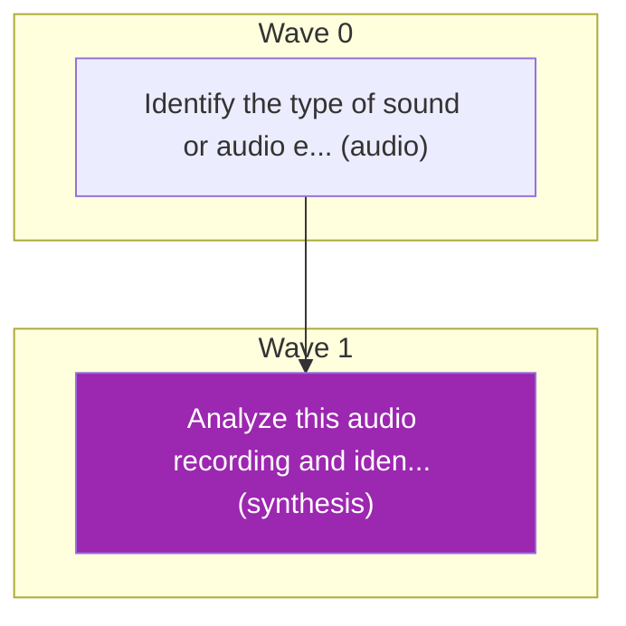

# Task Plan
**Job:** Analyze this audio recording and identify what type of sound or audio event it contains.

[User has provided a Audio file at: inputs/audio.wav]

| Node ID | Description | Capability | DNA Flags | Demand | Cost Ceiling | Latency SLO | Depends On |
|---------|-------------|------------|-----------|--------|--------------|-------------|------------|
| a | Identify the type of sound or audio event in the provided audio file | audio | `audio_event_recognition`, `audio_input` | 0.08 | $0.2500 | 6000ms | - |
| final | Analyze this audio recording and identify what type of sound or audio event it contains. | synthesis | `answer.synthesis`, `reasoning.deep` | 0.50 | $0.2500 | 13500ms | a |

## Capability DNA (per subtask)

- **`a`** — flags `['audio_event_recognition', 'audio_input']`
  - ordinals: reasoning_depth=1, planning_horizon=0, tool_complexity=0, memory_dependence=0, parallelizability=4
  - constraints: cost≤$0.2500, latency≤6000ms, min_quality≥0.48, risk≤low
  - effective min_quality after ordinals: 0.48
  - extracted by `openai/gpt-oss-20b` (confidence 0.95)
- **`final`** — flags `['answer.synthesis', 'reasoning.deep']`
  - ordinals: reasoning_depth=4, planning_horizon=2, tool_complexity=0, memory_dependence=4, parallelizability=0
  - constraints: cost≤$0.2500, latency≤13500ms, min_quality≥0.65, risk≤low
  - effective min_quality after ordinals: 0.65
  - extracted by `kernel` (confidence 1.00)

**Waves:** Wave 0: a | Wave 1: final

