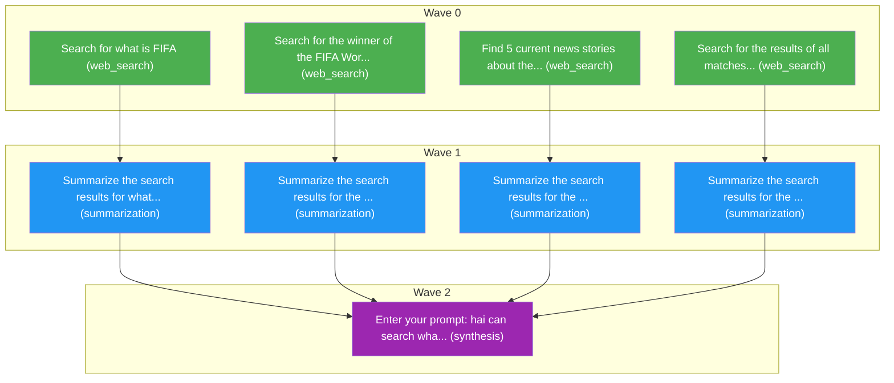

# Task Plan
**Job:** Search FIFA information and news

| Node ID | Description | Capability | DNA Flags | Demand | Cost Ceiling | Latency SLO | Depends On |
|---------|-------------|------------|-----------|--------|--------------|-------------|------------|
| a | Search for what is FIFA | web_search | `web.search` | 0.00 | $0.0556 | 13500ms | - |
| b | Search for the winner of the FIFA World Cup 2026 | web_search | `web.search` | 0.00 | $0.0556 | 13500ms | - |
| c | Find 5 current news stories about the FIFA president | web_search | `web.search` | 0.00 | $0.0556 | 13500ms | - |
| d | Search for the results of all matches of Argentina | web_search | `web.search` | 0.00 | $0.0556 | 13500ms | - |
| e | Summarize the search results for what is FIFA | summarization | `text.summarization` | 0.33 | $0.0556 | 13500ms | a |
| f | Summarize the search results for the winner of the FIFA World Cup 2026 | summarization | `text.summarization`, `web.search` | 0.33 | $0.0556 | 22500ms | b |
| g | Summarize the search results for the FIFA president news | summarization | `text.summarization` | 0.33 | $0.0556 | 13500ms | c |
| h | Summarize the search results for the results of all matches of Argentina | summarization | `text.summarization`, `web.search` | 0.33 | $0.0556 | 22500ms | d |
| final | Enter your prompt: hai can search what is fifa and can you tell who is the winner of the fifa world cup 2026 and also fetch 5 news about fifa president thats going on now and get the results of all match of argentina | synthesis | `answer.synthesis`, `reasoning.deep` | 0.50 | $0.0556 | 13500ms | e, f, g, h |

## Capability DNA (per subtask)

- **`a`** — flags `['web.search']`
  - ordinals: reasoning_depth=0, planning_horizon=0, tool_complexity=0, memory_dependence=0, parallelizability=4
  - constraints: cost≤$0.0556, latency≤13500ms, min_quality≥0.45, risk≤high
  - effective min_quality after ordinals: 0.45
  - extracted by `llama-3.1-8b-instant` (confidence 0.90)
- **`b`** — flags `['web.search']`
  - ordinals: reasoning_depth=0, planning_horizon=0, tool_complexity=0, memory_dependence=0, parallelizability=4
  - constraints: cost≤$0.0556, latency≤13500ms, min_quality≥0.45, risk≤high
  - effective min_quality after ordinals: 0.45
  - extracted by `llama-3.1-8b-instant` (confidence 0.90)
- **`c`** — flags `['web.search']`
  - ordinals: reasoning_depth=0, planning_horizon=0, tool_complexity=0, memory_dependence=0, parallelizability=4
  - constraints: cost≤$0.0556, latency≤13500ms, min_quality≥0.45, risk≤high
  - effective min_quality after ordinals: 0.45
  - extracted by `llama-3.1-8b-instant` (confidence 0.90)
- **`d`** — flags `['web.search']`
  - ordinals: reasoning_depth=0, planning_horizon=0, tool_complexity=0, memory_dependence=0, parallelizability=4
  - constraints: cost≤$0.0556, latency≤13500ms, min_quality≥0.45, risk≤high
  - effective min_quality after ordinals: 0.45
  - extracted by `llama-3.1-8b-instant` (confidence 0.90)
- **`e`** — flags `['text.summarization']`
  - ordinals: reasoning_depth=2, planning_horizon=1, tool_complexity=1, memory_dependence=1, parallelizability=3
  - constraints: cost≤$0.0556, latency≤13500ms, min_quality≥0.58, risk≤low
  - effective min_quality after ordinals: 0.58
  - extracted by `llama-3.1-8b-instant` (confidence 0.90)
- **`f`** — flags `['text.summarization', 'web.search']`
  - ordinals: reasoning_depth=2, planning_horizon=1, tool_complexity=1, memory_dependence=1, parallelizability=3
  - constraints: cost≤$0.0556, latency≤22500ms, min_quality≥0.58, risk≤high
  - effective min_quality after ordinals: 0.58
  - extracted by `llama-3.1-8b-instant` (confidence 0.90)
- **`g`** — flags `['text.summarization']`
  - ordinals: reasoning_depth=2, planning_horizon=1, tool_complexity=1, memory_dependence=1, parallelizability=3
  - constraints: cost≤$0.0556, latency≤13500ms, min_quality≥0.58, risk≤low
  - effective min_quality after ordinals: 0.58
  - extracted by `llama-3.1-8b-instant` (confidence 0.90)
- **`h`** — flags `['text.summarization', 'web.search']`
  - ordinals: reasoning_depth=2, planning_horizon=1, tool_complexity=1, memory_dependence=1, parallelizability=3
  - constraints: cost≤$0.0556, latency≤22500ms, min_quality≥0.58, risk≤high
  - effective min_quality after ordinals: 0.58
  - extracted by `llama-3.1-8b-instant` (confidence 0.90)
- **`final`** — flags `['answer.synthesis', 'reasoning.deep']`
  - ordinals: reasoning_depth=4, planning_horizon=2, tool_complexity=0, memory_dependence=4, parallelizability=0
  - constraints: cost≤$0.0556, latency≤13500ms, min_quality≥0.65, risk≤low
  - effective min_quality after ordinals: 0.65
  - extracted by `kernel` (confidence 1.00)

**Waves:** Wave 0: a, b, c, d | Wave 1: e, f, g, h | Wave 2: final

