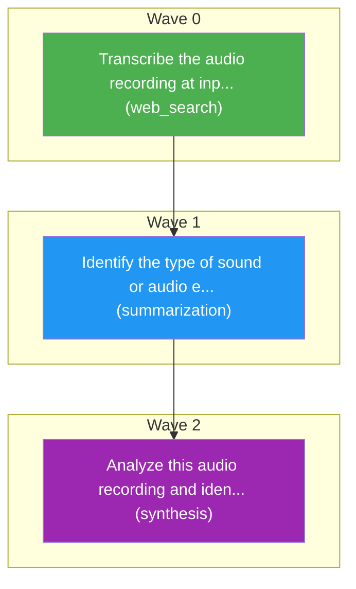

# Task Plan
**Job:** Analyze this audio recording and identify what type of sound or audio event it contains.

| Node ID | Description | Capability | DNA Flags | Demand | Cost Ceiling | Latency SLO | Depends On |
|---------|-------------|------------|-----------|--------|--------------|-------------|------------|
| a | Transcribe the audio recording at inputs/audio.wav | web_search | `audio_classification` | 0.33 | $0.1667 | 6000ms | - |
| b | Identify the type of sound or audio event in the transcription from node a | summarization | `audio_event_recognition` | 0.33 | $0.1667 | 6000ms | a |
| final | Analyze this audio recording and identify what type of sound or audio event it contains. | synthesis | `answer.synthesis`, `reasoning.deep` | 0.50 | $0.1667 | 13500ms | b |

## Capability DNA (per subtask)

- **`a`** — flags `['audio_classification']`
  - ordinals: reasoning_depth=2, planning_horizon=1, tool_complexity=1, memory_dependence=1, parallelizability=3
  - constraints: cost≤$0.1667, latency≤6000ms, min_quality≥0.58, risk≤low
  - effective min_quality after ordinals: 0.58
  - extracted by `llama-3.1-8b-instant` (confidence 0.90)
- **`b`** — flags `['audio_event_recognition']`
  - ordinals: reasoning_depth=2, planning_horizon=1, tool_complexity=1, memory_dependence=1, parallelizability=3
  - constraints: cost≤$0.1667, latency≤6000ms, min_quality≥0.58, risk≤low
  - effective min_quality after ordinals: 0.58
  - extracted by `llama-3.1-8b-instant` (confidence 0.90)
- **`final`** — flags `['answer.synthesis', 'reasoning.deep']`
  - ordinals: reasoning_depth=4, planning_horizon=2, tool_complexity=0, memory_dependence=4, parallelizability=0
  - constraints: cost≤$0.1667, latency≤13500ms, min_quality≥0.65, risk≤low
  - effective min_quality after ordinals: 0.65
  - extracted by `kernel` (confidence 1.00)

**Waves:** Wave 0: a | Wave 1: b | Wave 2: final

